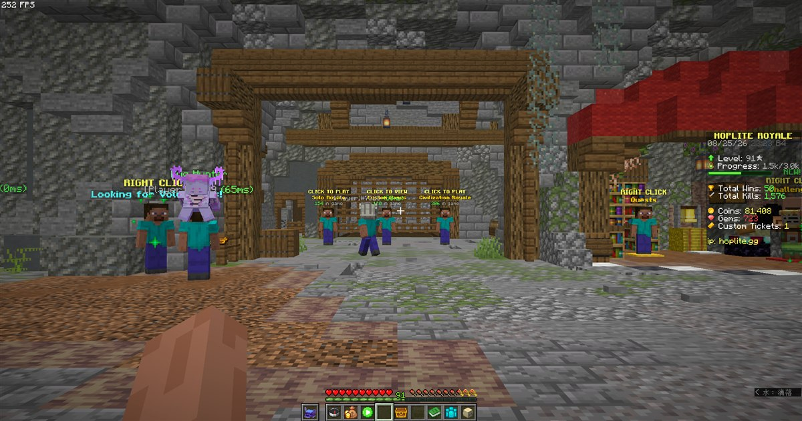
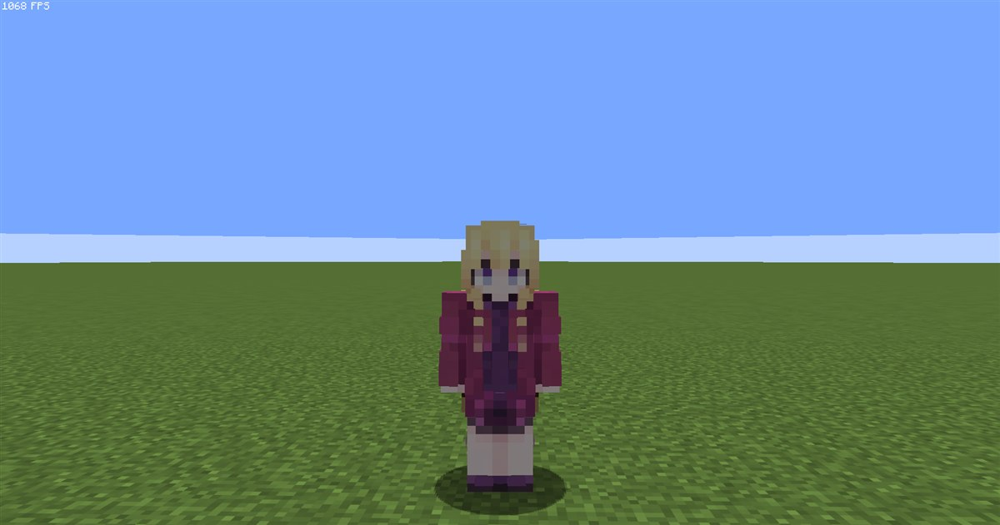
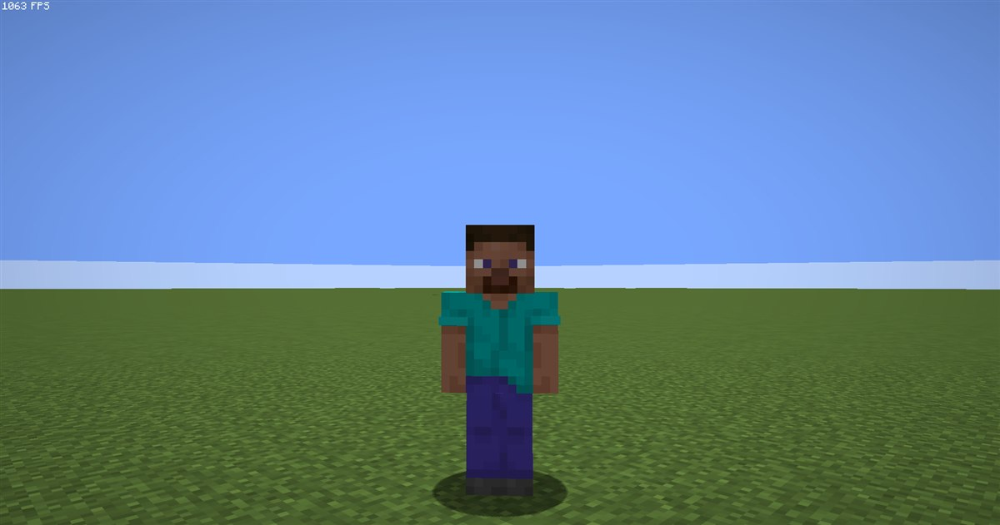
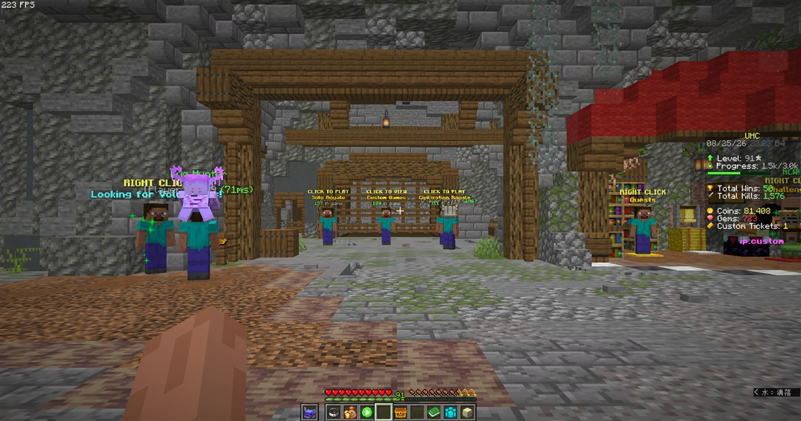
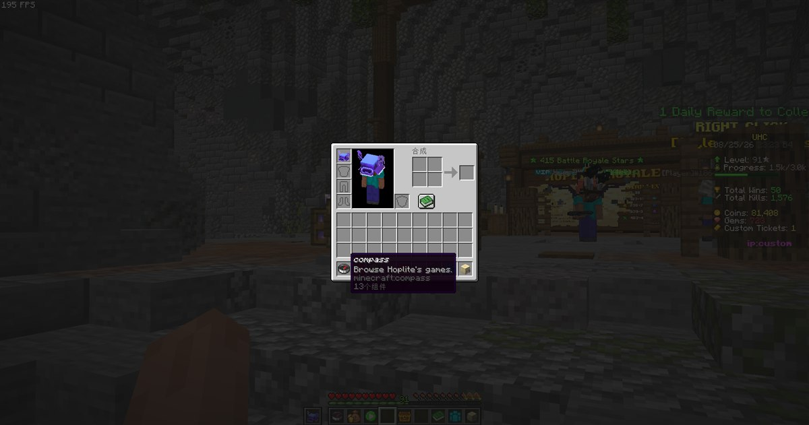
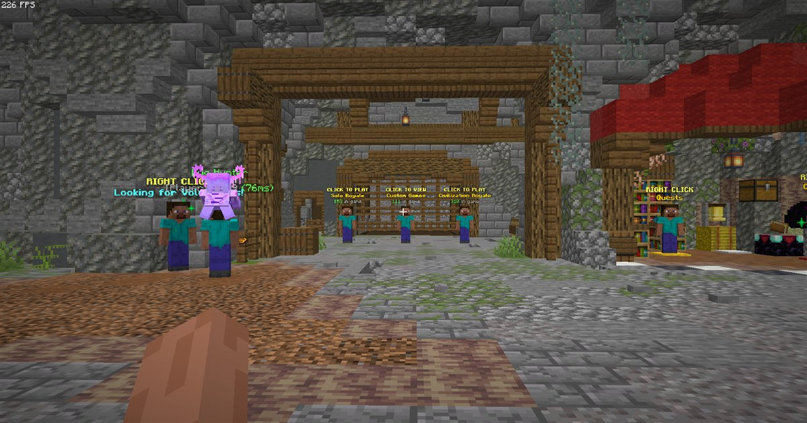

**[English](README.md) | [简体中文](README.zh.md)**

# StreamShield

一个 **Minecraft (Fabric, 1.21.11) 客户端模组**，让你的直播画面更安全。它能匿名化玩家名、归一化物品名、重写计分板/关键词内容、遮蔽皮肤，并提供 OBS 遮罩层，让敏感 HUD 信息不会泄露到直播画面。

## 功能

- **玩家名匿名化** — 真实玩家名变为 `[Player]+#0000`（自己的名字可为 `HIDE` / `CUSTOM` / `RANDOM`）。
- **物品名归一化** — 改过名的物品显示其注册名。
- **内容遮蔽** — 关键词/正则匹配 + 自动抓取当前服务器的 IP 与名称。
- **计分板映射** — 链式"关键词 → 替换词"规则。
- **皮肤遮蔽** — 强制所有人显示为史蒂夫。
- **OBS 遮罩** — 把 HUD 元素隐藏/重定向到独立的遮罩目标。

## 截图

| 初始样式 | 玩家名匿名化 |
| --- | --- |
|  |  |

| 皮肤遮蔽（Steve） | 自定义计分板 |
| --- | --- |
|  |  |

| 物品名归一化 | OBS 遮罩（全部效果） |
| --- | --- |
|  |  |

## 运行要求

- Minecraft **1.21.11**（Fabric 加载器）+ Java **21**
- Fabric API、Architectury、Cloth Config（见 [`fabric.mod.json`](src/main/resources/fabric.mod.json)）

## 构建

需要 JDK 21。

```powershell
gradlew.bat build
```

产物在 `build/libs/[1.21.11]StreamShield-1.1.1.jar`。

## CI / 发布

GitHub Actions 在每次推送时构建；自动发布 **GitHub Release**（含构建出的 jar）。见 [`.github/workflows/build.yml`](.github/workflows/build.yml)。

## 发布到 Modrinth

许可为 **MIT**，在 Modrinth 上同样为 MIT 。

## 许可 / 第三方声明

本项目以 **MIT 许可**发布，见 [`LICENSE`](LICENSE)。

其中包含对 [OBS Overlay](https://github.com/zziger/obs-overlay)（作者 **zziger / Artem Dzhemesiuk**，同样为 MIT 许可）代码的移植。按其许可要求，原始版权声明与许可文本见 [`NOTICE.txt`](src/main/resources/NOTICE.txt) 与 [`licenses/OBS_OVERLAY_LICENSE.txt`](licenses/OBS_OVERLAY_LICENSE.txt)，并已打包进 jar。
